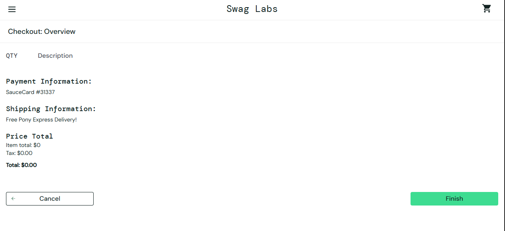

# Bug #01 — Checkout finaliza e gera comprovante com carrinho vazio (R$0,00)

**Severidade:** Alta | **Prioridade:** Alta (evidência de risco confirmada)

## Ambiente
Computador, Google Chrome, conexão Wi-Fi, https://www.saucedemo.com/

## Pré-condição
Usuário logado (`standard_user`); nenhum produto adicionado ao carrinho.

## Passos para reproduzir
1. Acessar o site e efetuar login
2. Clicar no ícone do carrinho (vazio)
3. Clicar no botão "Checkout"
4. Preencher First Name, Last Name e Zip/Postal Code, clicar em "Continue"
5. Clicar em "Finish"

## Resultado esperado
O sistema deveria bloquear o avanço já no passo 3, informando que o carrinho está vazio.

## Resultado obtido
O sistema permite o fluxo completo e gera um comprovante de pedido com item total R$0,00, taxa R$0,00 e total R$0,00 — sem nenhum produto listado.

## Evidência

[Ver comprovante do pedido em PDF](../evidencias/checkout/caso3-comprovante-valor-zero.pdf)

## Impacto
**Observado no SauceDemo:** gera um comprovante de pedido indevido, sem produtos.

**Projetado para uma aplicação real** (não confirmado, hipótese de risco): em um e-commerce de produção com integrações reais, esse mesmo comportamento poderia gerar custo de API por pedido fantasma (e-mail/notificação de confirmação disparada sem necessidade), exposição a abuso automatizado (geração em massa de pedidos vazios), e confusão operacional no sistema de gestão de pedidos (OMS), que processaria pedidos sem itens para separar ou enviar.
