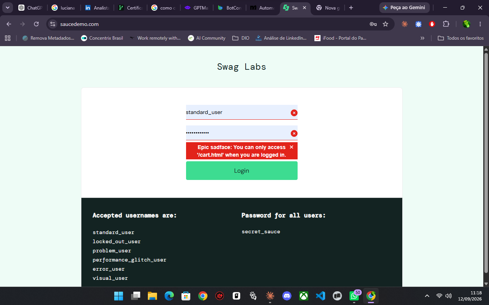
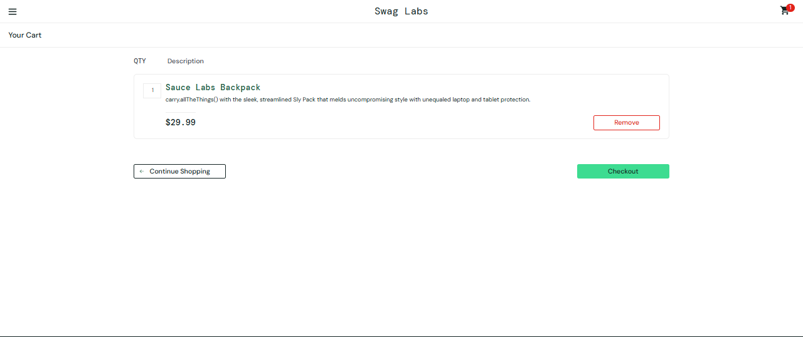
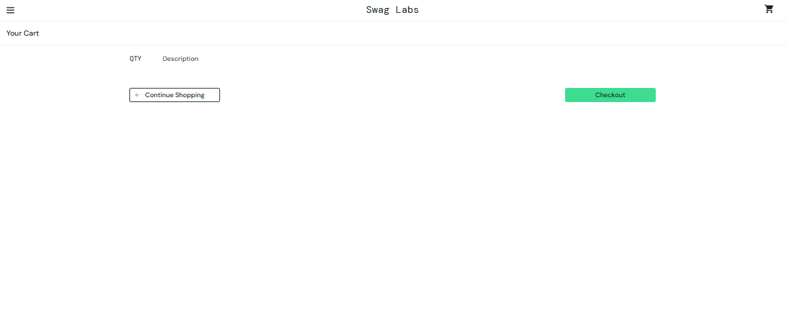
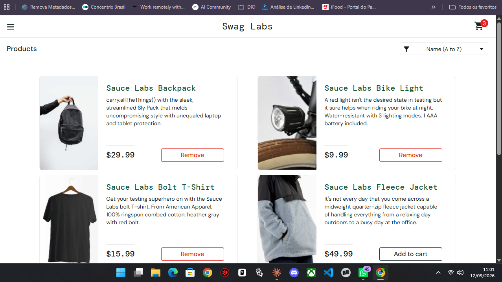

# Bug #02 — Logout automático por inatividade com mensagem enganosa

**Severidade:** Média-Alta | **Prioridade:** Alta (evidência de risco confirmada)

## Ambiente
Computador, Google Chrome, conexão Wi-Fi, https://www.saucedemo.com/

## Pré-condição
Usuário logado (`standard_user`).

## Passos para reproduzir
1. Efetuar login com usuário e senha válidos
2. Deixar o site aberto, sem executar nenhuma ação, por aproximadamente 17 minutos (confirmado reprodutível também em 30 min, 1h e 2h — independente do elemento da tela clicado depois)
3. Clicar em qualquer elemento da interface (carrinho, produto ou menu de opções)

## Resultado esperado
O sistema deveria desconectar o usuário e informar claramente o motivo — por exemplo, "sua sessão expirou por inatividade, faça login novamente".

## Resultado obtido
O sistema desconecta o usuário, mas exibe a mensagem: *"Epic sadface: You can only access '/cart.html' when you are logged in."* — uma mensagem que sugere que o usuário nunca esteve logado, não que a sessão expirou. O carrinho de compras permanece intacto após um novo login.

## Evidência

 (mostra o carrinho com itens antes do teste, para comparação com a persistência pós-logout)

## Impacto
Mensagem de erro que não comunica a causa real gera confusão para o usuário, que pode interpretar como falha do sistema em vez de expiração natural de sessão. Isso pode causar insatisfação e desincentivar o retorno à plataforma. O carrinho ser preservado é um ponto positivo que reduz o dano — o incômodo é de comunicação, não de perda de dados.
